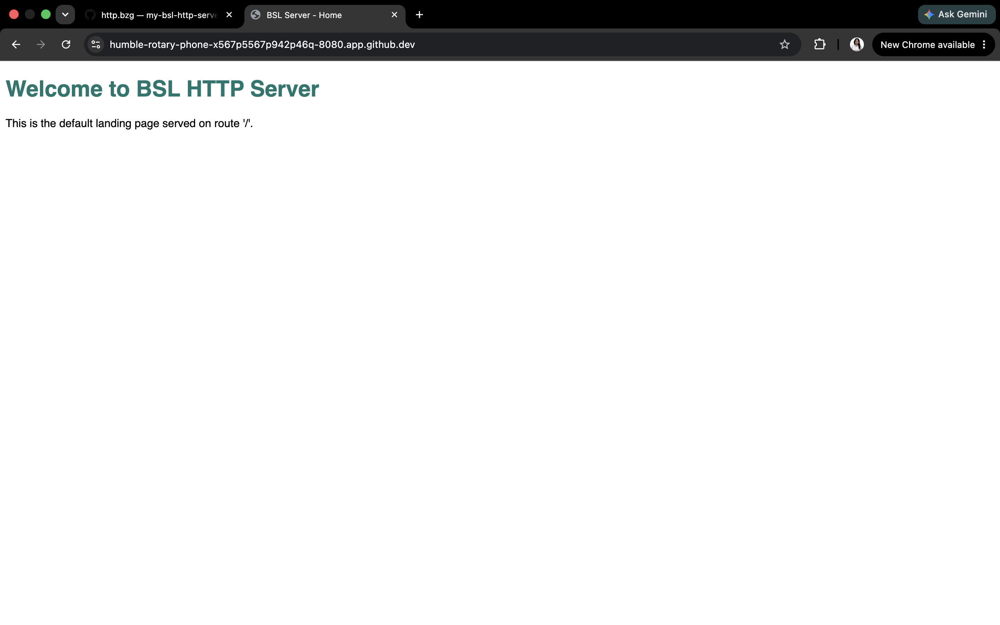
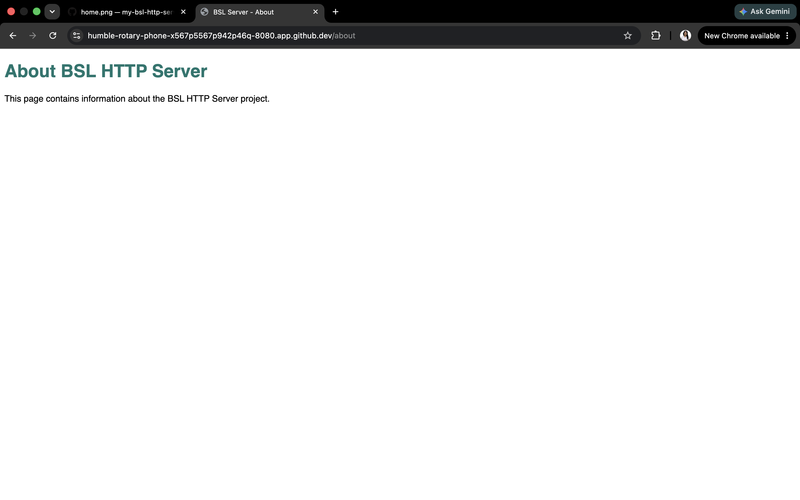
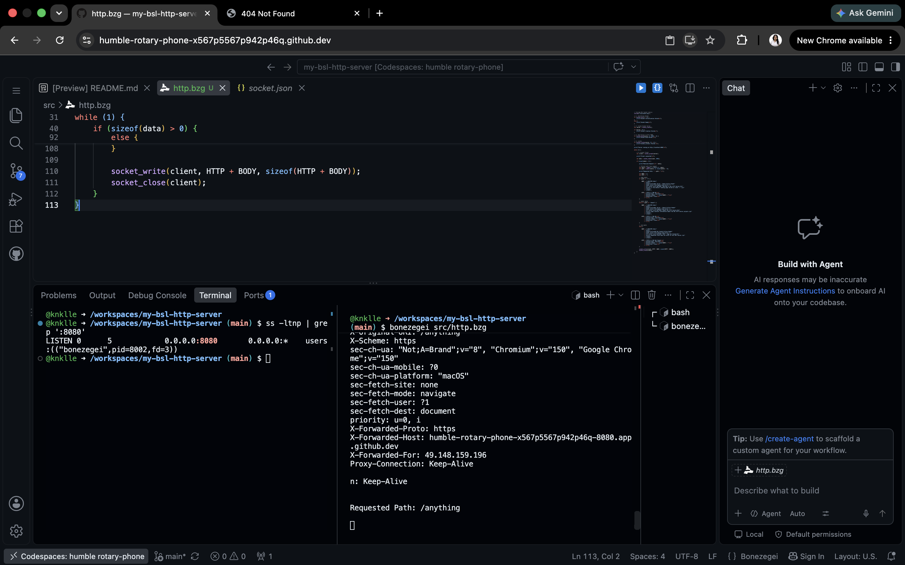

# my-bsl-http-server

# BSL HTTP Server

## Project Description
Explain that this project is a low-level HTTP server built using
Bonezegei Scripting Language and the BSL Socket Library.

## Installation and Setup
1. Install Bonezegei
2. Install the socket library:
   bzg install socket
3. Run:
   bonezegei src/http.bzg

## Usage
- `/` - Home page
- `/about` - About page
- Any other route - 404 Not Found

## Screenshots

### Home

### About

### 404 Page

### Terminal

## License
MIT License
